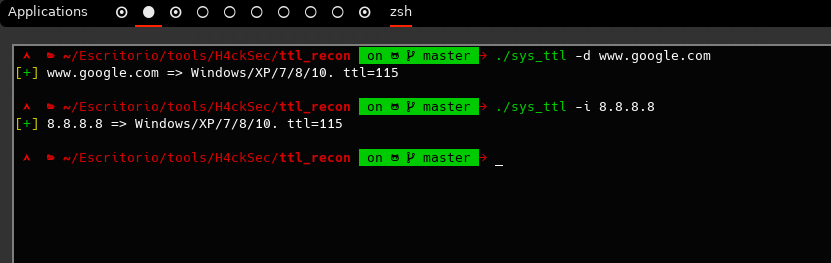

<html>

Esta herramienta es hecha para relizar una detecion de sistema en base al ttl.
Que es el ttl?
(Fuente de google)
El TTL forma parte de la cabecera IP con un tamaño de 8 bits. El valor se inicializa en el emisor y tiene la función de ir descontando de un contador una unidad según el datagrama IP viaje de un nodo a otro, por lo que debe de ser recalculado en cada salto. Si dicho contador llega a cero, descarta el paquete recibido y lo reenvía al destino del que proviene en vez de difundirlo. Este campo de la cabecera IP impide la congestión o sobrecarga en las colas de las líneas de trasmisión, ya que si un paquete está en la cola, el TTL se decrementa también si pasa un largo periodo.

Cada sistema regresa una ttl en base al sistema que maneja

Linux 1 - 64
Windows = 65 - 128
Solaris 129 - 255

La herramineta detecta el ttl de respueta en base a un paquete icmp enviado.

</html>
